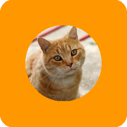

# &pi;conic

Generate project icon from image.

Support png, jpeg, webp, bmp, [svg2.0](https://github.com/srwiley/oksvg).

## Installation

Require go 1.22+

```shell
go install github.com/mawngo/piconic@latest
```

## Usage

Generate icon using image

```shell
> piconic .\my-image.jpeg
```

Or generate for all images in directory

```shell
> piconic .\my-dir
```

## Options

```
> piconic --help
Generate icon from images

Usage:
  piconic [files...] [flags]

Flags:
  -o, --out string       Output directory name (default ".")
  -w, --overwrite        Overwrite output if exists
  -s, --size uint        Size of the output image (default 200)
  -b, --bg string        Background color ['transparent', 'auto', 'auto,fallback', hex, material, svg 1.1] (default "auto")
      --trim string      List of color to trim when process image (default "transparent")
  -p, --padding uint     Padding of the icon image (by % of the size) (default 10)
  -r, --round uint       Round the output image (by % of the size)
      --src-round uint   Round the source image (by % of the size)
      --padx int         Additional padding to the x axis (by % of the size)
      --pady int         Additional padding to the y axis (by % of the size)
      --debug            Enable debug mode
  -h, --help             help for piconic

```

### Color support

All flags that accept color support the following values:

- `transparent`
- hex colors, for example, `#ffffff`
- [material colors](https://m2.material.io/design/color/the-color-system.html), for example, `Yellow500`
- [svg1.1 colors](docs/SVG1.1_Color_Swatch.svg.png), for example, `yellow`
- auto, based on the image border color, for example, `auto`, `auto,#ffffff`

## Examples

### Generate simple icon

```
piconic eyes.png
```

```shell
5:31PM INF Processing img=eyes.png dimension=160x160 bg=#f1f5f9 size=200
5:31PM INF Processing completed took=5.339563ms
```

| Original                   | Icon                                       |
|----------------------------|--------------------------------------------|
|  |  |

### Customized generation

```
piconic cat.jpg --round=20 --src-round=100 --bg=Orange500 --padding=20 --size=250
```

```shell
5:38PM INF Processing img=cat.jpg dimension=241x240 bg=Orange500 size=250
5:38PM INF Processing completed took=11.122575ms
```

| Original                 | Icon                                     |
|--------------------------|------------------------------------------|
|  |  |
